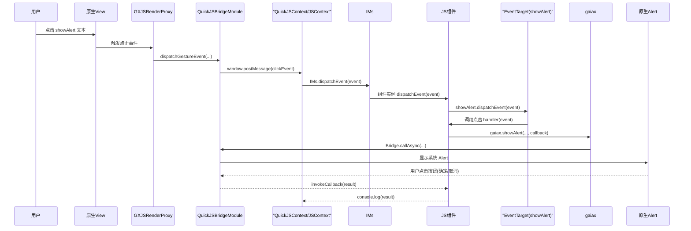

### 选一个具体例子: `showAlert` 按钮点击 → JS 回调

先用你给的模板脚本 [`gx-with-js-api-demo.js`](file:///Users/biezhihua/Workspace/YKMAIN/GaiaX-Github-Sync/GaiaXAndroidDemo/app/src/main/assets/gaiax_js_code/gx-with-js-api-demo.js) 里的 **“showAlert 按钮”** 走一遍完整链路。

JS 里对应的代码是:

```js
registerTipsAPI: function () {
  let showAlert = this.getElementById("showAlert");
  if (showAlert) {
    showAlert.addEventListener("click", async (event) => {
      gaiax.showAlert(
        { title: "我是标题", message: "我是消息" },
        (result) => {
          console.log(result);
        }
      );
    });
  }
}
```

模板结构和数据绑定:

- 模板配置 [`index.json`](file:///Users/biezhihua/Workspace/YKMAIN/GaiaX-Github-Sync/GaiaXAndroidDemo/app/src/main/assets/assets_data_source/templates/gx-with-js-api-demo/index.json) 中有一层:

  ```json
  { "id": "showAlert", "type": "text" }
  ```

- 数据绑定 [`index.databinding`](file:///Users/biezhihua/Workspace/YKMAIN/GaiaX-Github-Sync/GaiaXAndroidDemo/app/src/main/assets/assets_data_source/templates/gx-with-js-api-demo/index.databinding) 里有:

  ```json
  "showAlert": { "value": "$showAlert" }
  ```

也就是说,原生布局里有一个 `id = "showAlert"` 的 Text 节点,JS 通过 `getElementById("showAlert")` 拿到它的 JS 封装对象。

### 调用时序图




---

### 1. 初始化阶段: 组件实例和点击监听是怎么建起来的

从引擎初始化细节你已经有文档了,这里只贴跟这个模板相关的关键步骤:

1. **模板渲染 & JS 组件注册**

   - GaiaX Android 渲染模板 `gx-with-js-api-demo` 时,会在 JS 运行时中执行这段文件:

     ```js
     Component({ ...上面的对象... });
     ```

   - 这实际上调用的是 `bootstrap.js` 里挂到全局的 `Component(...)`,内部会:

     - 创建一个 `__Component__` 实例(即“JS 组件实例”),挂上:
       - 生命周期方法: `onReady` / `onShow` / `onHide` / `onDestroy` / `onReuse` 等
       - 自定义方法: `registerTipsAPI` / `registerStorageAPI` / `registerTimerAPI` 等
     - 把这个实例注册到 `IMs.insertComponent(...)` 里,建立:
       - `componentInstanceId` ↔ JS 组件实例 的映射
       - 以及和页面实例的关联

2. **`onReady` 被宿主调用**

   - 模板首帧渲染完成后,Android 侧会调用:

     ```kotlin
     GXJSEngine.onReady(componentId)
     ```

   - 该调用经过:
     - `GXJSEngine` → `GXHostEngine.runtime().context()` → `GXHostContext.getComponent(componentId)`
     - `GXHostComponent.onReady()` 内部再通过构造脚本,在 JS 侧调用这个组件实例的 `onReady` 方法。

   - JS 运行时里就会执行你在脚本里写的:

     ```js
     onReady: function () {
       this.registerStorageAPI();
       this.registerTipsAPI();
       this.registerTimerAPI();
       this.registerMessageAPI();
     }
     ```

3. **`registerTipsAPI` 给 `showAlert` 注入 click 事件**

   - `this.getElementById("showAlert")` 调用的其实是 `__Component__` 上的实现,它会:

     - 通过 `NativeTarget.getElementByData({ pageId, pageInstanceId, componentId, componentInstanceId, targetId: "showAlert" })` 向 Native 查询这个 target 的类型等信息。
     - 根据返回的 meta 信息构造一个 `GaiaXJSEventTarget` 实例,并缓存起来:  
       - 里面挂着这个元素的 `targetId`/`targetType`/`targetSubType`/`templateId`/`instanceId` 等。

   - `showAlert.addEventListener("click", ...)` 调用的是 `GaiaXJSEventTarget.prototype.addEventListener`:

     - 内部会先调用 `NativeEvent.addEventListener({ templateId, targetId, instanceId, eventType: "click", option })`:
       - 通过 Bridge → QuickJSBridgeModule → `GXJSRenderProxy.addGestureEventListener(...)`
       - 最终在 Android 的 GX 节点上注册一个点击手势监听(`OnClickListener` 或 `GestureDetector` 等)
     - 等原生确认注册成功后,再在 JS 侧的 `listenersMap` 中记录:
       - 对于当前 `GaiaXJSEventTarget` 实例,事件类型 `"click"` 对应的回调函数(你写的那个 arrow function)。

到这里为止,“某个原生视图 + 对应 JS 组件实例上的 click 监听器”这条链路就建好了。

---

### 2. 用户点击 `showAlert` 文本时,链路如何闭环到 JS 回调

从现在开始发生的是“事件运行时流程”(点击 → JS 回调),按时间线描述:

1. **用户在界面点击 `showAlert` 文本**

   1. 原生 `View` 收到点击事件,Android 侧的手势监听被触发。
   2. GaiaX 的事件层(`GXNodeEvent`/`GXEventManager`/`GXJSRenderProxy.dispatchGestureEvent`)把这个点击识别为:
      - 模板 id = `"gx-with-js-api-demo"`
      - 组件 instanceId = 某个 long
      - 目标 node id = `"showAlert"`
      - 事件类型 = `"click"`

2. **Native → JS: 事件对象进入 JS 引擎**

   1. `GXJSRenderProxy.dispatchGestureEvent(...)` 会组装一个事件 JSON,通过 JS Bridge 调用 QuickJS:

      - 这一步通过 `GXJSEngine` / `QuickJSBridgeModule` 之类的桥接代码,最终在 QuickJS 里调用到 `window.postMessage(...)` 或专用的事件分发入口。

   2. 在 `bootstrap.js` 中,`GaiaXJSWindow.postMessage` 会:

      - 把原生传来的参数封装成一个 `GaiaXJSEvent` 实例:
        - `templateId` = `"gx-with-js-api-demo"`
        - `instanceId` = 当前组件/页面实例 id
        - `targetId` = `"showAlert"`
        - `type` = `"click"`
        - `userData` = 携带的业务数据(如果有)
      - 调用 `IMs.dispatchEvent(event)` 统一分发事件。

   3. `IMs.dispatchEvent` 会根据事件里是否有 `instanceId`/`templateId`/`targetId` 分两步路由:

      - 先根据 `instanceId` 找到对应的 Page 或 Component 实例:
        - 在本例中是 JS 组件实例 `__Component__` 对象。
      - 再调用该实例的 `dispatchEvent(event)`。

3. **组件实例 → 目标元素: 找到 `showAlert` 对应的 GaiaXJSEventTarget**

   在 `GaiaXJSComponentTarget.prototype.dispatchEvent` 中:

   - 如果 `event.targetId` 不为空(本例是 `"showAlert"`),则:

     1. 从组件内部的 `this.targets["${componentInstanceId}_${targetId}"]` 缓存中找到之前创建的 `GaiaXJSEventTarget` 实例:
        - 这个实例对应的就是模板里 id 为 `"showAlert"` 的那块 Text。
     2. 调用 `target.dispatchEvent(event)` 将事件转发给该元素。

4. **GaiaXJSEventTarget.dispatchEvent → 触发你注册的回调**

   - 在 `GaiaXJSEventTarget.prototype.dispatchEvent` 中,逻辑大致为:

     1. 从 `listenersMap` 中取出当前 `this` 对象上,事件类型为 `"click"` 的 listener:
        - 这是前面 `addEventListener("click", (event) => {...})` 注册进去的。
     2. 如果 listener 存在,调用 `listener.call(this, event)`:
        - `this` 指向组件实例或目标对象(实现里用 `call` 绑定)
        - `event` 是封装好的 `GaiaXJSEvent`,你在 JS 回调里可以访问 `event.templateId` / `event.instanceId` / `event.data` 等。

   - 这时,就进入了你在 `gx-with-js-api-demo.js` 中写的回调:

     ```js
     showAlert.addEventListener("click", async (event) => {
       gaiax.showAlert(
         { title: "我是标题", message: "我是消息" },
         (result) => {
           console.log(result);
         }
       );
     });
     ```

   到这里,“从用户点击到 JS 回调被调用”的整条链路就完成了。

---

### 3. JS 回调内再调用 Native API 的链路(以 `gaiax.showAlert` 为例)

在上述 JS 回调内部,你还调用了 `gaiax.showAlert(...)`,这又是一次 **JS → Native → JS 回调** 的完整过程:

1. **JS 侧调用 `gaiax.showAlert`**

   - `gaiax` 对象是 bootstrap & 模块脚本中挂到全局的 API 容器,内部最终会通过 `Bridge.callAsync` 或 `Bridge.callPromise` 路由到 Native。
   - `Bridge.callAsync` 会:
     - 将 `{ module: 'Tips', method: 'showAlert', args: {...}, contextId: __CONTEXT_ID__ }` 构造成 JSON
     - 调用 Native 侧 `GaiaXJSBridge.callAsync(...)`(通过 QuickJSBridgeModule 暴露的方法)
     - 对于 callback 模式,还会分配一个 `callbackId`,记录在 `__successCallbacks` / `__failureCallbacks` map 里。

2. **Native 执行 Alert,并回调 JS**

   - QuickJSBridgeModule 收到 callAsync 请求后,通过 `GXHostContext.bridge.callAsync(...)` 交给 `GXModuleManager` 调用对应 `GXJSBaseModule` 实现的 Alert 逻辑。
   - 原生弹出系统 Alert,用户点击“确定”或“取消”后,模块在 Native 中调用:
     - `Bridge.invokeCallback(callbackId, result)` 或
     - `Bridge.invokePromiseSuccess/Failure(...)` 对应 Promise 风格。

3. **Bridge 在 JS 侧分发结果到你的回调**

   - `Bridge.invokeCallback` 在 JS 中执行时,会从 `__successCallbacks` / `__failureCallbacks` map 里取到之前注册的回调,比如你传入的:

     ```js
     (result) => {
       console.log(result);
     }
     ```

   - 调用这个回调之后,再把该 `callbackId` 从 map 中删除,避免内存泄漏。

这样,**从用户点击 `showAlert` → JS 点击回调 → 调用原生 Alert → 原生回调 JS** 的全链路就全部打通了。

---

### 4. 小结: 套到你这份 JS 文件上的“点击 → JS 回调”通用模式

对 `gx-with-js-api-demo.js` 里的其他按钮(如 `getStorage`、`setInterval` 等),流程都是同一套,只是调用的 Native API 不同:

- **事件绑定**:  
  `this.getElementById("xxx").addEventListener("click", handler)` → JS SDK 通过 `NativeEvent.addEventListener` 为某个模板节点注册点击事件。
- **事件触发**:  
  用户点击 → 原生事件 → `GXJSRenderProxy.dispatchGestureEvent` → Bridge → `window.postMessage` → `IMs.dispatchEvent` → 组件实例 → 对应 `GaiaXJSEventTarget.dispatchEvent` → 调用你写的 `handler`。
- **Handler 内部 JS → Native 调用**:  
  `gaiax.xxx(...)` 或 `window.postMessage(...)` 再通过 Bridge 回到原生模块/引擎,必要时带着 callback/promise 把结果回传给 JS。

如果你想,我可以针对 `gaiax.getStorage` 或 `this.addNativeEventListener("CustomNotificationNameForNative", ...)` 再画一张专门的时序图,把「JS 自定义事件」和「原生通知回 JS」的链路也拉通。