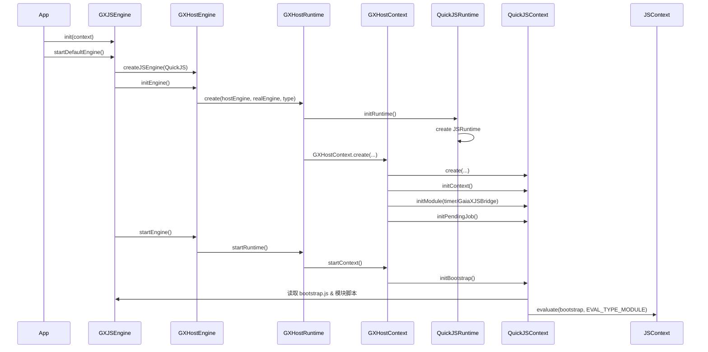

### 整体回答先说结论

**从调用链上看,`bootstrap.js` 就是 GaiaX Android JS SDK 在 QuickJS 里“铺底”的那一层运行时环境**, 它本身不做业务逻辑,负责在 JS 侧建立:

- 模块系统(`__gaiaxjs_require__`, `__gaiaxjs_modules__`)
- Page/Component 抽象、事件体系、动画/曝光/埋点等 JS SDK 能力
- JS ↔ Native 的 Bridge 调用封装(`Bridge`, `window.postMessage` 等)
- Page/Component 实例管理(`IMs = InstancesManager`)

而 **整条调用链是从 `GXJSEngine.startDefaultEngine()` 一路传到 `QuickJSContext.startBootstrap()` 再到 QuickJS `evaluate(bootstrap)` 执行的**。下面按链路一步步拆开。

### 调用时序图



---

### 一、从 App 到 JSContext: 启动 JS 引擎

以生产 QuickJS 引擎为例:

1. **业务初始化 JS 引擎**

   - 调用:  
     - `GXJSEngine.instance.init(context)`  
     - `GXJSEngine.instance.startDefaultEngine()`

   - `GXJSEngine.startDefaultEngine()` 内部:
     - 创建 `GXHostEngine` 实例:  
       ```kotlin
       val engine = GXHostEngine.create(id, EngineType.QuickJS)
       engine.initEngine()
       ```
     - 然后调用 `engine.startEngine()`

2. **`GXHostEngine.initEngine()`: 创建底层 QuickJS 运行时**

   在 [`GXHostEngine`](file:///Users/biezhihua/Workspace/YKMAIN/GaiaX-Github-Sync/GaiaXAndroidJS/src/main/kotlin/com/alibaba/gaiax/js/engine/GXHostEngine.kt) 中:

   - 创建真实引擎 `QuickJSEngine`(`realEngine`), 执行 `realEngine.initEngine()`
   - 创建宿主运行时 `GXHostRuntime`:
     ```kotlin
     hostRuntime = GXHostRuntime.create(this, engine, type)
     hostRuntime?.initRuntime()
     ```

3. **`GXHostRuntime.initRuntime()`: 创建 QuickJSRuntime 和 HostContext**

   在 [`GXHostRuntime`](file:///Users/biezhihua/Workspace/YKMAIN/GaiaX-Github-Sync/GaiaXAndroidJS/src/main/kotlin/com/alibaba/gaiax/js/engine/GXHostRuntime.kt):

   - 创建 `QuickJSRuntime`(`realRuntime`), 执行 `realRuntime.initRuntime()`:
     - 里面会通过 `QuickJS.Builder().build().createJSRuntime()` 建立 `JSRuntime`
     - 配置栈大小、Promise 拒绝处理等
   - 创建 `GXHostContext`:
     ```kotlin
     hostContext = GXHostContext.create(this, runtime, type)
     hostContext?.initContext()
     ```

4. **`GXHostContext.initContext()`: 创建 QuickJSContext, 初始化基础模块**

   在 [`GXHostContext`](file:///Users/biezhihua/Workspace/YKMAIN/GaiaX-Github-Sync/GaiaXAndroidJS/src/main/kotlin/com/alibaba/gaiax/js/engine/GXHostContext.kt):

   - 创建 `QuickJSContext` 作为真实 JS 上下文(`realContext`):
     ```kotlin
     realContext = QuickJSContext.create(this, hostRuntime.realEngine, realRuntime)
     ```
   - 初始化任务队列 `GaiaXJSTaskQueue`
   - 调用 `realContext` 的一组初始化方法:
     ```kotlin
     realContext?.initContext()      // 创建 JSContext
     realContext?.initModule("timer")
     realContext?.initModule("GaiaXJSBridge")
     realContext?.initPendingJob()   // 定时 executePendingJob
     ```

   对应到 [`QuickJSContext.initContext()`](file:///Users/biezhihua/Workspace/YKMAIN/GaiaX-Github-Sync/GaiaXAndroidJS/src/main/kotlin/com/alibaba/gaiax/js/impl/qjs/QuickJSContext.kt):

   ```kotlin
   jsContext = runtime.jsRuntime?.createJSContext()
   ```

   对应到 [`QuickJSContext.initModule()`](file:///Users/biezhihua/Workspace/YKMAIN/GaiaX-Github-Sync/GaiaXAndroidJS/src/main/kotlin/com/alibaba/gaiax/js/impl/qjs/QuickJSContext.kt):

   - `"timer"`: 注入 `setTimeout`/`setInterval` 等到 `globalObject`
   - `"GaiaXJSBridge"`: 注册 [`QuickJSBridgeModule`](file:///Users/biezhihua/Workspace/YKMAIN/GaiaX-Github-Sync/GaiaXAndroidJS/src/main/kotlin/com/alibaba/gaiax/js/impl/qjs/module/QuickJSBridgeModule.kt) 为 Bridge 回调, 并调用 `jsContext.initModuleBridge("GaiaXJSBridge")`

   `initPendingJob()` 则是定时调用 `jsContext.executePendingJob()`, 驱动 QuickJS 的微任务队列。

---

### 二、从 `startEngine` 到 `bootstrap.js`: 构造并执行 Bootstrap 脚本

1. **`GXHostEngine.startEngine()` → `GXHostRuntime.startRuntime()`**

   [`GXHostEngine.startEngine()`](file:///Users/biezhihua/Workspace/YKMAIN/GaiaX-Github-Sync/GaiaXAndroidJS/src/main/kotlin/com/alibaba/gaiax/js/engine/GXHostEngine.kt):

   ```kotlin
   hostRuntime?.startRuntime()
   ```

   [`GXHostRuntime.startRuntime()`](file:///Users/biezhihua/Workspace/YKMAIN/GaiaX-Github-Sync/GaiaXAndroidJS/src/main/kotlin/com/alibaba/gaiax/js/engine/GXHostRuntime.kt):

   ```kotlin
   hostContext?.startContext()
   ```

2. **`GXHostContext.startContext()` → 触发 bootstrap 构造和执行**

   在 [`GXHostContext`](file:///Users/biezhihua/Workspace/YKMAIN/GaiaX-Github-Sync/GaiaXAndroidJS/src/main/kotlin/com/alibaba/gaiax/js/engine/GXHostContext.kt):

   ```kotlin
   fun startContext() {
       realContext?.initBootstrap()
       realContext?.startBootstrap()
   }
   ```

3. **`QuickJSContext.initBootstrap()`**: 拼接完整 Bootstrap 脚本字符串

   在 [`QuickJSContext`](file:///Users/biezhihua/Workspace/YKMAIN/GaiaX-Github-Sync/GaiaXAndroidJS/src/main/kotlin/com/alibaba/gaiax/js/impl/qjs/QuickJSContext.kt):

   ```kotlin
   override fun initBootstrap() {
       if (bootstrap == null) {
           val contextId = hostContext.hostRuntime.hostEngine.engineId
           val sb = StringBuilder()
           sb.append(GXScriptBuilder.buildImportScript())
           sb.append(GXScriptBuilder.buildGlobalContext(contextId, 0))
           sb.append(GXScriptBuilder.buildExtendAndAssignScript())
           sb.append(
               GXJSEngine.instance.context.resources.assets
                   .open(GXHostContext.BOOTSTRAP_JS) // 即 bootstrap.js
                   .bufferedReader(Charsets.UTF_8).use { it.readText() }
           )
           sb.append(GXJSEngine.instance.moduleManager.buildModulesScript(EngineType.QuickJS))
           sb.append(GXScriptBuilder.buildStyle())
           bootstrap = sb.toString()
       }
   }
   ```

   这里非常关键:

   - `buildImportScript()`/`buildExtendAndAssignScript()`: 为 GaiaX JS 构造 `import`/`extend` 等辅助代码
   - `buildGlobalContext(contextId, 0)`:
     - 在 JS 全局写入 `__CONTEXT_ID__`、`__ENGINE_TYPE__` 等运行时标识
   - `assets.open("bootstrap.js")`: **读取你提到的 `bootstrap.js` 全量内容**
   - `moduleManager.buildModulesScript(...)`: 把所有注册的 JS 模块代码拼成一段脚本, 注册到 `__gaiaxjs_modules__`
   - `buildStyle()`: 构造样式相关的 JS 代码

   最终 `bootstrap` 变量是一大段合成后的 JS 源码字符串。

4. **`QuickJSContext.startBootstrap()` → 真正调用 QuickJS 执行**

   ```kotlin
   override fun startBootstrap() {
       bootstrap?.let { evaluateJS(it) }
   }

   override fun evaluateJS(script: String, argsMap: JSONObject) {
       jsContext?.evaluate(script, "index.js", JSContext.EVAL_TYPE_MODULE, 0)
   }
   ```

   - 使用 `JSContext.EVAL_TYPE_MODULE` 模式执行, 让脚本以 ES Module 的方式初始化
   - 文件名逻辑上统一叫 `"index.js"`, 主要用于堆栈信息

**到这一步,`bootstrap.js` 已经连同 import/globalContext/模块/样式一起被 QuickJS 执行完了**, JS SDK 的“运行时世界”就建立好了。

---

### 三、`bootstrap.js` 自身做了什么: JS SDK 如何“铺底”

虽然 `bootstrap.js` 被压缩成一行,从内容上可以归纳为三大类逻辑:

1. **运行时基础设施: Polyfill + 模块系统**

   例如:

   - `__extends`, `__assign`, `__awaiter`, `__generator`: TypeScript/编译器输出的辅助函数
   - `__gaiaxjs_modules__`, `__gaiaxjs_module_cache__`, `__gaiaxjs_require__`:
     - 维护模块定义表和缓存
     - 提供 `require()` 功能
   - `__globalThis.__gaiaxjs_exports__`, `__globalThis.exports`: CommonJS 风格导出兼容

   **作用**: 把 QuickJS 当成一个“浏览器+Node 混合环境”来使用,让上层模块可以用模块化、类、Promise 等语法平滑运行。

2. **Page/Component/事件/动画等 GaiaX JS 抽象**

   `bootstrap.js` 中定义了一系列 GaiaX JS SDK 的核心对象,并挂到 `__globalThis`:

   - **事件与目标**
     - `GaiaXJSEvent`: 包装原生事件数据,暴露 `templateId`/`instanceId`/`targetId`/`type` 等属性
     - `GaiaXJSEventTarget`:
       - 封装单个 Native 视图(`targetId`,`targetType`,`targetSubType`)
       - 具备 `addEventListener`/`removeEventListener`/`dispatchEvent` 等接口
       - 内部通过 `NativeEvent`/`NativeTarget` 对接原生事件和坐标

   - **组件与页面**
     - `GaiaXJSComponentTarget`: 持有组件的 meta 信息(组件 id、版本、所属页面等)
     - `__Component__` 和全局函数 `Component(...)`:
       - `Component(props, meta)` 会创建一个组件实例,保存生命周期方法(`onDataInit`/`onReady`/`onShow`...), state, 以及组件数据
       - 调用 `IMs.insertComponent(...)` 把实例注册进实例管理器
     - `__Page__` 和全局函数 `Page(...)`:
       - `Page(props, meta)` 创建页面实例,保存页面生命周期(`onLoad`/`onReady`/`onShow`/`onHide`/`onUnload`/`onPageScroll`/`onReachBottom`)
       - 同样注册到 `IMs.insertPage(...)`,并设置 `currentPageInstanceId`

   - **实例管理器 IMs (`InstancesManager`)**
     - 维护:
       - `componentInstanceMaps`: instanceId → 组件实例
       - `pageInstanceMaps`: instanceId → 页面实例
       - `pageComponentMaps`: pageInstanceId → 该页所有组件实例 id
     - 提供 `getComponent`/`getPage`/`getAllComponentsOfPage`/`dispatchEvent` 等
     - 用于:
       - 当事件到达时,按 `instanceId` 找到对应 Page/Component 并调用其 `dispatchEvent`/`onXxx`

   - **动画与时间线**
     - `GaiaXJSAnimationTimeline` + `GaiaXJSKeyframeEffect`/`GaiaXJSLottieEffect` 等:
       - 封装动画描述,构造 Native 所需的动画参数(JSON)
       - 通过 `NativeAnimation.play(...)` 真正驱动原生动画
     - 用 `__globalThis.timeline` 暴露统一时间线对象

   - **日志与埋点**
     - `Log2APlus`/`Log2Alarm`/`GaiaXJSAPlusAdapter` 等:
       - 封装曝光/点击埋点(`EXP`/`CLK`)和告警上报逻辑
       - 通过 `gaiax.mtop` 等接口调原生/网络

   - **工具与 StickyEvent**
     - `__Utils`: merge、md5/urlEncode/base64 等工具方法,内部调用 `NativeUtil`
     - `GaiaXJSStickyEventManager`(`sticky`):
       - 管理“粘性事件”,在新注册的 Page/Component 加入监听后可以立即收到历史事件

   最后,`bootstrap.js` 把这些统一挂在全局:

   ```js
   __globalThis.Event = GaiaXJSEvent;
   __globalThis.EventTarget = GaiaXJSEventTarget;
   __globalThis.Component = Component;
   __globalThis.Page = Page;
   __globalThis.Log2APlus = GaiaXJSLog2APlus;
   __globalThis.Log2Alarm = GaiaXJSLog2Alarm;
   __globalThis.IMs = new InstancesManager();
   __globalThis.window = new GaiaXJSWindow();
   __globalThis.timeline = new GaiaXJSAnimationTimeline();
   __globalThis.Utils = __Utils;
   __globalThis.sticky = new GaiaXJSStickyEventManager();
   __globalThis.require = __gaiaxjs_require__;
   ```

3. **JS ↔ Native Bridge 封装 (`Bridge`, `window`)**

   关键对象:

   - **Bridge**
     - 静态方法 `callSync`/`callAsync`/`callPromise`:
       - 内部统一将 `contextId: __CONTEXT_ID__` 塞到参数里
       - 调用 `GaiaXJSBridge` 模块(由 QuickJSBridgeModule 在原生注册)
     - 用 `callbackId` + 全局 `__successCallbacks`/`__failureCallbacks` 管理异步回调/Promise

   - **GaiaXJSWindow**
     - `window.postMessage`/`postNativeMessage`/`postAnimationMessage`/`postModalMessage` 等:
       - 封装 `GaiaXJSEvent` 之后转交给 `IMs.dispatchEvent(...)`/`dispatchNativeEvent(...)`/`dispatchModalEvent(...)`
       - 实现从原生到 JS 的事件广播

   整体上是:

   - **JS → Native**: 
     - 业务脚本通过 `Bridge.callSync/Async/Promise` 调用模块方法
     - QuickJSBridgeModule 在 native 里解析 JSON → 通过 `GXHostContext.bridge` → `GXModuleManager` → 具体 `GXJSBaseModule` 实现
   - **Native → JS**:
     - 原生事件/动画/弹窗结果等 → 通过 `GXScriptBuilder.buildPostXXXMessage(...)` 拼 JS 代码 → `GXHostContext.evaluateJS` 执行
     - JS 侧 `window.postMessage` 等 API 把事件转换成 `GaiaXJSEvent` 并由 `IMs` 分发到对应 Page/Component 实例。

---

### 四、结合调用链看“运作原理”: 一个完整生命周期例子

以「启动引擎 + 加载页面 + 事件回调」为例,串一下:

1. **引擎/运行时初始化**
   - App: `GXJSEngine.init(context)` → `startDefaultEngine()`
   - 创建 `GXHostEngine` → `GXHostRuntime` → `GXHostContext` → `QuickJSRuntime` + `QuickJSContext`
   - `QuickJSContext` 初始化模块(`timer`, `GaiaXJSBridge`),启动 `executePendingJob` 轮询

2. **执行 Bootstrap,搭建 JS SDK 环境**
   - `GXHostContext.startContext()` → `QuickJSContext.initBootstrap()` 拼接脚本,包含:
     - import/extend/globalContext(`__CONTEXT_ID__`, `__ENGINE_TYPE__`)
     - `assets/bootstrap.js` 内容
     - 所有模块脚本 + 样式脚本
   - `QuickJSContext.startBootstrap()` → `JSContext.evaluate(bootstrap, "index.js", EVAL_TYPE_MODULE)`
   - 执行完成后,JS 侧已有:
     - 全局 `Page`/`Component`/`Event` 等类
     - 全局实例 `IMs`, `window`, `timeline`, `Bridge`, `sticky` 等

3. **注册页面/组件脚本**
   - 当模板需要 JS 时,原生会通过 `GXJSEngine.registerPage(...)`/`registerComponent(...)`
   - 内部通过 [`GXScriptBuilder`](file:///Users/biezhihua/Workspace/YKMAIN/GaiaX-Github-Sync/GaiaXAndroidJS/src/main/kotlin/com/alibaba/gaiax/js/support/script/GXScriptBuilder.kt) 生成一段 JS:
     - 类似: 调用全局 `Page({...}, meta)` 或 `Component({...}, meta)`
   - `GXHostContext.evaluateJS(script)` 执行这段 JS
   - JS 中的 `Page(...)`/`Component(...)` 会构造 `__Page__`/`__Component__` 实例,并通过 `IMs.insertPage/insertComponent` 注册
   - 至此,“JS 逻辑对象”与“模板/实例 id”等原生数据建立了映射

4. **事件/生命周期驱动**
   - 原生在适当时机调用 `GXJSEngine.onPageLoad`/`onPageShow`/`onEvent` 等
   - 这些调用通过 `quickJSEngine.runtime().context()` 找到对应 `GXHostContext`,再找到 `GXHostPage`/`GXHostComponent`
   - `GXHostPage/GXHostComponent` 再构造 JS 调用脚本(比如调用 `Page` 实例的 `onLoad`/`onReady`/`onShow`),通过 `GXHostContext.evaluateJS` 执行
   - JS 侧实际调用的就是 `__Page__/__Component__` 里的业务方法,比如:
     - 用户在 JS 脚本中写的:
       ```js
       Page({
         state: { ... },
         onLoad(data) { ... },
         onReady() { ... }
       }, meta);
       ```

5. **JS 调原生 + 异步任务**
   - JS 在页面/组件方法中可以:
     - 使用 `Bridge.callPromise(...)` 调原生模块
     - 使用 `setTimeout`/`setInterval` 安排异步任务
     - 使用 `timeline.play(...)` 触发动画
   - 对应地,原生通过:
     - QuickJSBridgeModule 将调用请求路由到 `GXModuleManager` 管理的模块
     - `QuickJSTimer` 将 JS 的定时任务映射成 `GXHostContext.executeDelayTask/executeIntervalTask`
     - QuickJS `executePendingJob` 轮询执行 microtask 队列,配合 `GXHostContext.initPendingJob()` 保证异步顺序正确

---

### 五、小结

**用一句话概括**: 

- **`GXJSEngine.startDefaultEngine()` 负责把 QuickJS 打开,建立 `JSRuntime` + `JSContext` 和 Host 封装层;**
- **`QuickJSContext.initBootstrap()` 把 `bootstrap.js` 与全局上下文/模块/样式拼接成完整 bootstrap 脚本;**
- **`JSContext.evaluate(...)` 执行后,`bootstrap.js` 中定义的 Page/Component/Bridge/InstancesManager 等构成了 GaiaX JS SDK 的“操作系统”;**
- 之后所有页面脚本和事件交互,都在这套 runtime 上运行,通过 Bridge 和 `GXHostContext` 在 JS ↔ Native 之间往返。

如果你希望,我可以再画一个**更精简的调用时序图**或者挑一个具体模板的 JS 文件,配合这一套链路走一遍“从点击到 JS 回调”的完整例子。